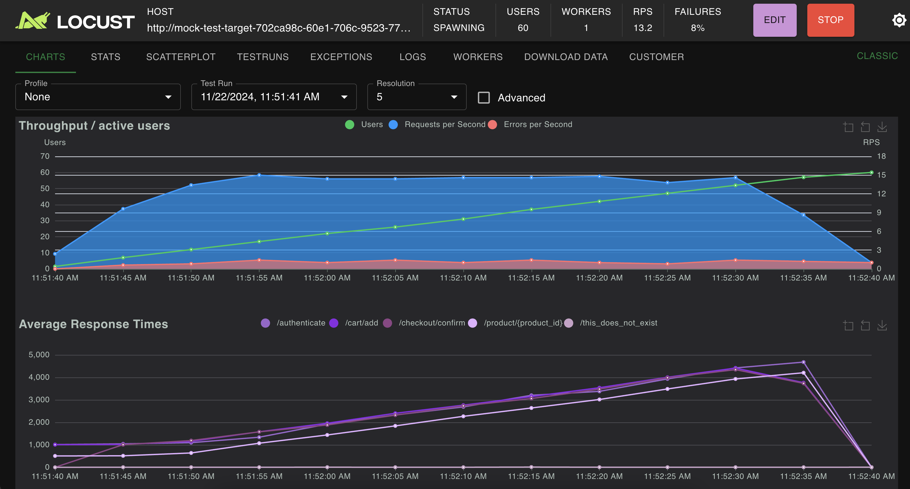

Locustfile and mock server
==========================

If you're learning Locust and want to try it out, Locust Cloud has its own demo mock server you can test against, using the locustfile below. Pass ``--host https://mock-test-target.eu-north-1.locust.cloud`` test against the mock server.

.. code-block:: console

    $ locust --cloud -f my_locustfile.py --users 100 --host https://mock-test-target.eu-north-1.locust.cloud

.. code-block:: python

    from locust import HttpUser, task

    class MyUser(HttpUser):
        @task
        def t(self):
            self.client.post("/authenticate", json={"username": "foo", "password": "bar"})
            for product_id in [1, 2, 42]:
                self.client.get(f"/product/{product_id}", name="/product/{product_id}")
                self.client.post("/cart/add", json={"productId": product_id})
            self.client.post("/checkout/confirm")
            self.client.get("/this_does_not_exist")

Your results should be something like this (the mock intentionally has some concurrency issues, so you'll get steadily rising response times as the load increases):

.. note::
    Don't use the mock server option when you are doing normal load tests. It is only meant as an example and serves no other purpose.

Passing options to Locust
=========================

Any arguments specified on command line will be passed along to Locust. This allows for a seamless transition from local runs to cloud runs.

Here's how to run a 100 User test, start immediately, run for 60 seconds,
quit 1s after finishing and print statistics to the console while running:

.. code-block:: console

    $ locust --cloud --users 100 --autostart --run-time 60s --autoquit 1 --print-stats
    [LOCUST-CLOUD] INFO: Authenticating (eu-north-1, v1.11.2.dev23)
    [LOCUST-CLOUD] INFO: Deploying load generators
    [LOCUST-CLOUD] INFO: Waiting for pods to be ready...
    [2024-11-22 11:49:20,833] master-lb6vv-zxp64/INFO/locust.main: Starting Locust 2.32.4.dev14 (locust-cloud 1.11.2.dev23)
    [2024-11-22 11:49:20,835] master-lb6vv-zxp64/INFO/locust.main: Starting web interface at https://locust.webui.locust.cloud/702ca98c-60e1-706c-9523-77d5c10ba5d4-free
    [2024-11-22 11:49:23,515] master-lb6vv-zxp64/INFO/locust.runners: worker-xn7mv-4zkh5_3b4ee8708ea140eda830ff00364af204 (index 0) reported as ready. 1 workers connected.
    [2024-11-22 11:49:24,018] master-lb6vv-zxp64/INFO/locust.main: Run time limit set to 60 seconds
    [2024-11-22 11:49:24,019] master-lb6vv-zxp64/INFO/locust.runners: Sending spawn jobs of 100 users at 1.00 spawn rate to 1 ready workers
    Type     Name                                         # reqs      # fails |    Avg     Min     Max    Med |   req/s  failures/s
    --------|-------------------------------------------|-------|-------------|-------|-------|-------|-------|--------|-----------
    POST     /authenticate                                     2     0(0.00%) |   1012    1010    1014   1010 |    0.00        0.00
    GET      /product/{product_id}                             1     0(0.00%) |    505     505     505    505 |    0.00        0.00
    --------|-------------------------------------------|-------|-------------|-------|-------|-------|-------|--------|-----------
            Aggregated                                        3     0(0.00%) |    843     505    1014   1000 |    0.00        0.00
    Type     Name                                         # reqs      # fails |    Avg     Min     Max    Med |   req/s  failures/s
    --------|-------------------------------------------|-------|-------------|-------|-------|-------|-------|--------|-----------
    POST     /authenticate                                     5     0(0.00%) |   1015    1010    1021   1010 |    0.67        0.00
    POST     /cart/add                                         5     0(0.00%) |   1005    1004    1007   1004 |    0.33        0.00
    GET      /product/{product_id}                             8     0(0.00%) |    508     504     520    510 |    0.67        0.00
    --------|-------------------------------------------|-------|-------------|-------|-------|-------|-------|--------|-----------
            Aggregated                                       18     0(0.00%) |    787     504    1021   1000 |    1.67        0.00
    Type     Name                                         # reqs      # fails |    Avg     Min     Max    Med |   req/s  failures/s
    --------|-------------------------------------------|-------|-------------|-------|-------|-------|-------|--------|-----------
    POST     /authenticate                                     9     0(0.00%) |   1013    1005    1021   1005 |    0.83        0.00
    POST     /cart/add                                        14     0(0.00%) |   1005    1003    1007   1003 |    1.17        0.00
    POST     /checkout/confirm                                 2     0(0.00%) |   1005    1005    1005   1005 |    0.00        0.00
    GET      /product/{product_id}                            18     0(0.00%) |    507     503     520    510 |    1.67        0.00
    GET      /this_does_not_exist                              2   2(100.00%) |      4       3       6      3 |    0.00        0.00
    ...
    [2024-11-22 11:50:24,019] master-lb6vv-zxp64/INFO/locust.main: --run-time limit reached, stopping test
    [2024-11-22 11:50:27,151] master-lb6vv-zxp64/INFO/locust.main: Shutting down (exit code 0)
    Type     Name                                         # reqs      # fails |    Avg     Min     Max    Med |   req/s  failures/s
    --------|-------------------------------------------|-------|-------------|-------|-------|-------|-------|--------|-----------
    POST     /authenticate                                   112     0(0.00%) |   2586    1003    4553   2500 |    1.89        0.00
    POST     /cart/add                                       239     0(0.00%) |   2674    1003    4989   2500 |    4.03        0.00
    POST     /checkout/confirm                                60     0(0.00%) |   2633    1003    4521   2500 |    1.01        0.00
    GET      /product/{product_id}                           262     0(0.00%) |   2156     503    4489   2000 |    4.41        0.00
    GET      /this_does_not_exist                             60  60(100.00%) |      4       2       8      4 |    1.01        1.01
    --------|-------------------------------------------|-------|-------------|-------|-------|-------|-------|--------|-----------
            Aggregated                                      733    60(8.19%) |   2254       2    4989   2100 |   12.35        1.01
    ...
    Error report
    # occurrences      Error
    ------------------|------------------------------------------------------------------------------------------------------------
    60                 GET /this_does_not_exist: HTTPError('404 Client Error: NOT FOUND for url: /this_does_not_exist')
    ------------------|------------------------------------------------------------------------------------------------------------
    [LOCUST-CLOUD] INFO: Tearing down Locust cloud...
    [LOCUST-CLOUD] INFO: Done! ✨

You can also use standard Locust env vars in the same fashion:

.. code-block::

    LOCUST_USERS=100 LOCUST_AUTOSTART=1 ... locust --cloud

Automated runs (CI)
===================

If you want to run tests in a CI/CD environment, where an interactive login is not possible, you can set the ``--non-interactive`` flag or ``LOCUSTCLOUD_NON_INTERACTIVE`` environment variable. Then Locust will use credentials specified environment variables instead.

Simply make sure to export the corrent environment variables before running the command and things will work.

.. code-block:: console

    export LOCUSTCLOUD_NON_INTERACTIVE=1
    export LOCUSTCLOUD_USERNAME='your@email.com'
    export LOCUSTCLOUD_PASSWORD='yourpassword'
    export LOCUSTCLOUD_REGION='us-east-1'
    ...

Typically you will also want to specify the standard Locust parameters ``--headless`` (or ``--autostart``) and ``--run-time`` as shown in the previous example. Here's a full example of how you might set it up in a GitHub action:

.. code-block:: yaml

    env:
        LOCUSTCLOUD_USERNAME: ${{ secrets.LOCUSTCLOUD_USERNAME }}
        LOCUSTCLOUD_PASSWORD: ${{ secrets.LOCUSTCLOUD_PASSWORD }}
        LOCUSTCLOUD_REGION: eu-north-1
        LOCUSTCLOUD_NON_INTERACTIVE: 1
        PYTHONUNBUFFERED: 1 # ensure we see output right away

    jobs:
        build:
            runs-on: ubuntu-latest
            timeout-minutes: 15
        steps:
            - uses: actions/checkout@v4
            - uses: actions/setup-python@v5
              with:
                python-version: '3.11' 
            - run: pip install locust
            - run: locust --cloud -f my_locustfile.py --headless --run-time 5m

Extra Python packages and files
===============================

If your locustfile needs some additional Python packages, you can install them by specifying a `requirements.txt <https://pip.pypa.io/en/stable/reference/requirements-file-format/>`_ file:

.. code-block:: console

    locust --cloud -f my_locustfile.py --requirements requirements.txt

If your package is not published to Pypi, requirements.txt can reference other repositories, just make sure it is reachable from the load generators:

.. code-block:: console

    --extra-index-url https://test.pypi.org/simple/ # your index url
    ... # your packages

You can also upload a package that you have locally:

.. code-block:: console

    --extra-packages helper.whl other-helper.tar.gz

You can also specify additional files (data files even entire directories/modules) to be copied to the load generators using the ``--extra-files`` option:

.. code-block:: console

    --extra-files testdata.csv more-testdata/

Locust will attempt to locate any local imports in your locustfile(s) and automatically include the necessary Python files, so in most cases you won't need to specify them explicitly.

.. code-block:: python

    # Locust will automatically upload some_module.py (or some_module/)
    from some_module import some_function

.. note::
    Ensure that any additional files you include are located within the current working directory.

View dashboard / previous test runs
===================================

You can examine the results from previous test runs (without needing to start your load generators) from your `Locust Cloud dashboard <https://auth.locust.cloud>`_.

Source IP Addresses
===================

If you need to whitelist source IP addresses in order to bypass firewalls or DDoS protections, here are the current IPs for each region:

US Region

.. code-block:: console

    23.22.141.121
    34.199.222.136
    44.198.252.211
    44.208.98.77
    52.86.221.153

EU Region

.. code-block:: console

    13.48.181.114
    13.53.152.168
    13.61.39.172
    51.21.47.95
